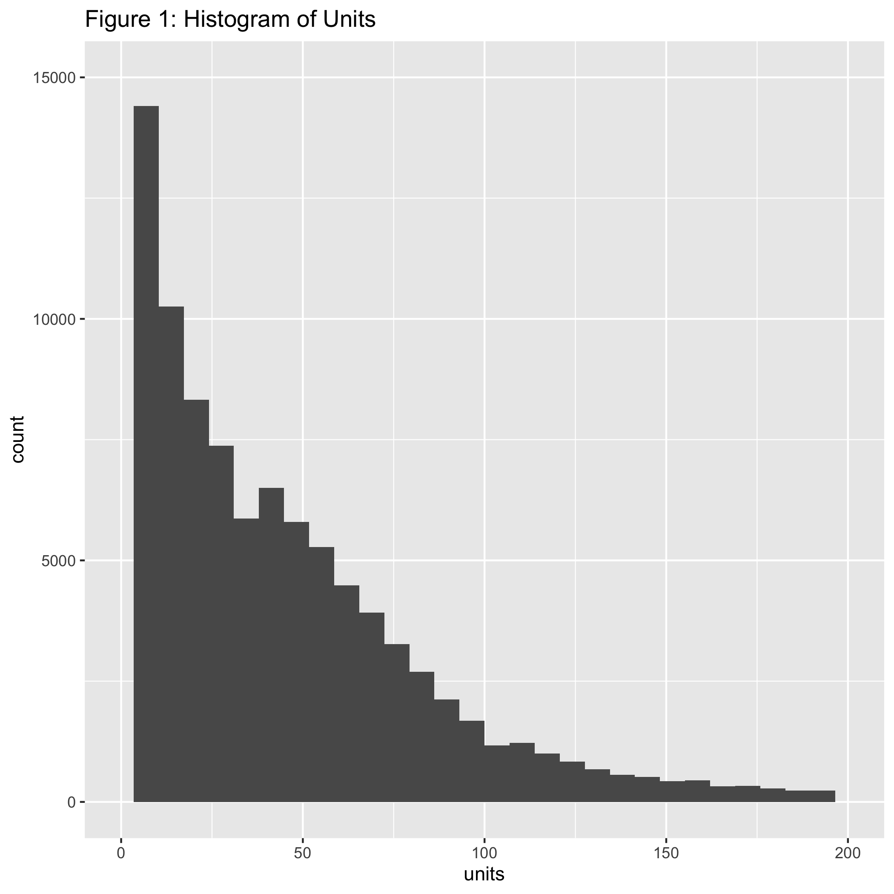
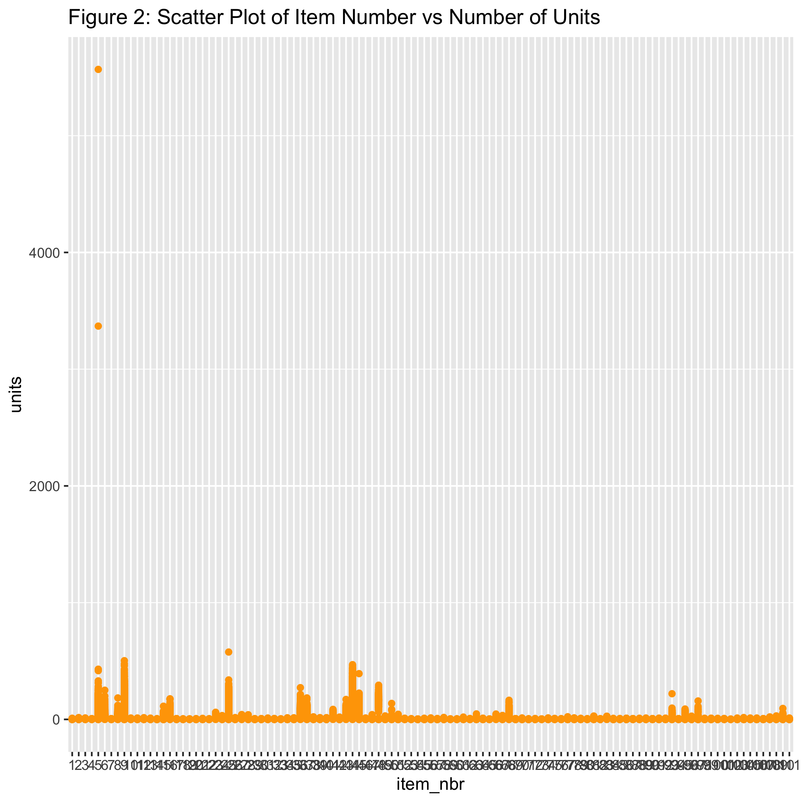
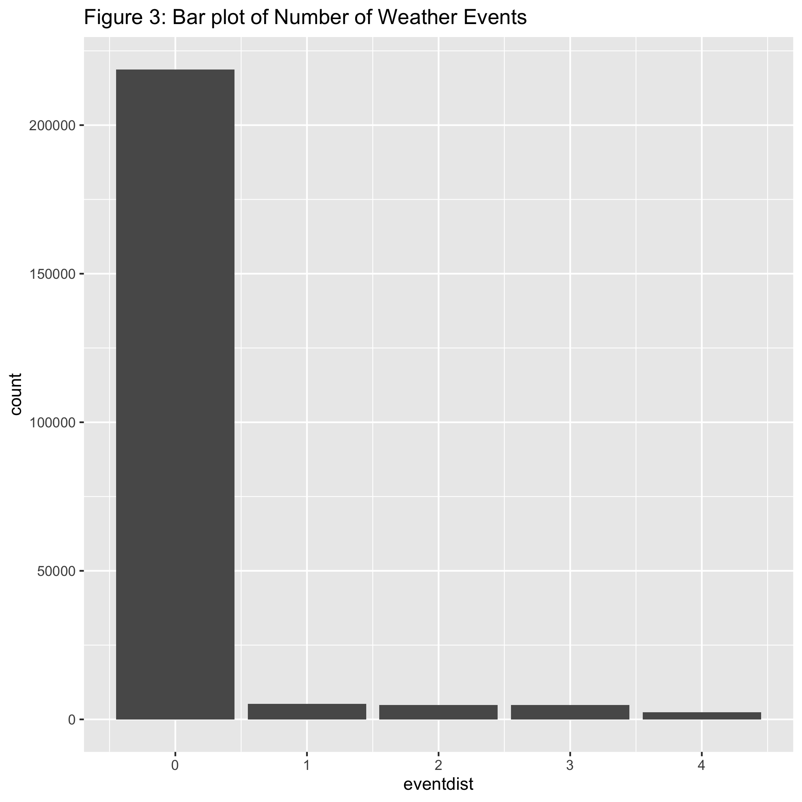

# Introduction

The purpose of this project is to predict the sales of various products sold around the time of major weather events. The main motivation behind this task - beyond the obvious implications of a Kaggle challenge - is studing the effect weather has been noted to have on retail sales creating fluctuations in demand because certain items are more useful during these weather events. [^1] This leads to a problem for producers with supply chain management and the so-called "bullwhip effect" [^2] where forecasts can lead to supply chain inefficiencies. Being able to make better predictions of the effect of the weather on sales will allow producers to choose a proper inventory and minimize the effect. 
	 
Walamrt has provided a training and testing dataset. The training data given consists of sales data from 45 different stores. The training dataset provided by Walmart gives us the data across these stores for the amount of a particular item sold, its item id and the date that each item is sold. Walmart also of course provides weather data across 20 stations per day. There’s extensive data on rainfall, wind speed, temperature, significant weather events and so on. Predictors like pressure, monthly rainfall, average sea level pressure and so on might not be that influential in terms of the final model, however we will see how influential these variables end up being based on our predictions. The evaluation metric for the testing dataset will be Root Mean Squared Logarithmic Error. To begin, a simplistic initial Ordinary least squares model will be fit to the dataset and evaluated for its effectiveness. Through some intermediary diagnostic tests, the OLS model will be further analyzed with a focus on understanding how this model can be improved to increase the accuracy of the prediction. Afterwards, various other methods that were discussed in STAT425 for more robust modeling will be considered/implemented. This includes techinques like ridge/lasso regression, feature selection through stepwise selection, and other methods.


# Exploratory Data Analysis


```{r setup, include=FALSE}
knitr::opts_chunk$set(echo = FALSE, eval = FALSE)
```

```{r, echo = FALSE}
library(dplyr)
library(ggplot2)
library(kableExtra)
library(tibble)
library(caret)
library(mltools)
library(data.table)
library("tidyverse")
library("dplyr")
library("rsample")
library("caret")
library("kableExtra")
library("doParallel")
library("microbenchmark")
library("foreach")
library("parallel")
library("gridExtra")
library("lubridate")
library("readr")
library("lmtest")
library("mltools")
library("data.table")
library("car")
library("bestNormalize")
```

```{r, eval = FALSE}
mergedata = read.csv("mergedata.csv")
testy = read.csv("mergedtestdata.csv")
weather = read.csv("weather.csv", stringsAsFactors = FALSE)
mergetestdata = read.csv("mergedtestdata.csv")
sample = read.csv("sampleSubmission.csv")
drops <- c("X", "key", "codesum", "station_nbr")
mergedata <- mergedata[ , !names(mergedata) %in% drops]
mergetestdata <- mergetestdata[ , !names(mergetestdata) %in% drops]

mergedata$date <- as.Date(mergedata$date, "%Y-%m-%d")
mergedata$store_nbr <- as.factor(mergedata$store_nbr)
mergedata$item_nbr <- as.factor(mergedata$item_nbr)
mergedata$id = paste0(as.character(mergedata$store_nbr), "_", as.character(mergedata$item_nbr))


mergetestdata$date <- as.Date(mergetestdata$date, "%Y-%m-%d")
mergetestdata$store_nbr <- as.factor(mergetestdata$store_nbr)
mergetestdata$item_nbr <- as.factor(mergetestdata$item_nbr)
mergetestdata$id = paste0(as.character(mergetestdata$store_nbr), "_", as.character(mergetestdata$item_nbr))
```


Before we consider any visualizations for variables, some investigation should be conducted with regards to missing data.

```{r, eval = FALSE}
weatherclean = weather
weatherclean[weatherclean == "M"] = NA
weatherclean[weatherclean == weatherclean$snowfall[37]] = 0
weatherclean$sunrise = as.numeric(weatherclean$sunrise)
weatherclean$sunset = as.numeric(weatherclean$sunset)
weatherclean[weatherclean == "-'"] = NA
weatherclean$date = as.Date(weatherclean$date, "%Y-%m-%d")

tibble(
  "Column" = colnames(weatherclean[-(1:3)]),
  "Percentage of Missing Values (%)" =  as.numeric(colMeans(is.na(weatherclean[-(1:3)]))) * 100
) %>%
  kable(caption = "Table 1: Percentage of Missing Values for Each Column of the Weather Dataset", digits = 4) %>%
  kable_styling("striped", full_width = FALSE, latex_options = "hold_position")
```

```{r, eval = FALSE, echo = FALSE}
# missing_unit_values = sum(mergedata$units == 0)
# all_ids = unique(mergedata$id)
# length_each_id = unlist(map(all_ids, function(x) sum(mergedata$id == x)))
# zeros_per_id = unlist(map(all_ids, function(x) sum(mergedata$id == x & mergedata$units == 0)))
# valid_ids = all_ids[length_each_id != zeros_per_id]
# no_zeros = mergedata[mergedata$id %in% valid_ids,]
# 
# no_zeros$blackFriday = 0
# no_zeros$blackFriday[no_zeros$date == "2013-11-29"] = 1
# no_zeros$blackFriday[no_zeros$date == "2012-11-23"] = 1
# 
# mergetestdata$blackFriday = 0
# mergetestdata$blackFriday[mergetestdata$date == "2014-11-28"] = 1
# 
# 
# write.csv(no_zeros, file = "refined_data.csv", row.names = FALSE)
# write.csv(mergetestdata, file = "mergedtestdata.csv", row.names = FALSE)

```


It can be seen that certain variables are missing a majority of their values, making it difficult to justify incorporating them into the full model. It is clear from this that the weather data provided to us is extremely incomplete - a good baseline model might be to just perform OLS on any sales related predictors and see how that model performs for the prediction task. Another "missing data" problem to consider is the task of considering all the units that had zero sold for a certain day. These observations constitute a majority of the dataset with around `r 0` observations consisting of zeros. With this large of an class imbalance between zeros and nonzeros, the prediction power of our model will be severly negatively impacted if regression is conducted with all of these `units = 0` observations. So to account for this, our training dataset will remove all of these observations where every instance of a store-item number pair that has all 0 unit counts.


Having cleaned the dataset, some basic frequency plots for each variable can be created:

```{r, include = FALSE}
refined_data = read.csv("refined_data.csv")

mergetestdata = read.csv("mergedtestdata.csv")

refined_data$date <- as.Date(refined_data$date, "%Y-%m-%d")
refined_data$store_nbr <- as.factor(refined_data$store_nbr)
refined_data$item_nbr <- as.factor(refined_data$item_nbr)

mergetestdata$date <- as.Date(mergetestdata$date, "%Y-%m-%d")
mergetestdata$store_nbr <- as.factor(mergetestdata$store_nbr)
mergetestdata$item_nbr <- as.factor(mergetestdata$item_nbr)
```

```{R, echo = FALSE}


# p1 = refined_data %>% 
#   ggplot(aes(x = units)) +
#   geom_histogram(bins = 30) + 
#   xlim(0, 200) +
#   ylim(0, 15000) +
#   ggtitle("Figure 1: Histogram of Units")
# 
# p2 = refined_data %>% 
#   ggplot(aes(x = item_nbr, y = units)) + 
#   geom_point(col = "orange") +
#   ggtitle("Figure 2: Scatter Plot of Item Number vs Number of Units")
# 
# p3 = refined_data %>%
#     ggplot(aes(x = eventdist, fill = eventdist)) +
#     geom_bar() +
#     ggtitle("Figure 3: Bar plot of Number of Weather Events")
# 
# gridExtra::grid.arrange(p1, p2, p3, ncol = 3)
```






Beginning with some exploratory data analysis, we can see that the histogram of units is skewed left and appears non-normal, we will check our normality assumption on the regression model. In the plot of item number vs unit there appear to be two outliers which we will want to correct for as we move forward. We will check the linear model for the cook's distance and ability to influence the regression under the modeling section.

For merging the data, the weather data was first cleaned and detrimental data features with near 50% of values missing were removed. These were depart, sunrise, and sunset. Then using the key each store in the train data set was matched with its given station and the weather and training data were then merged. For additional features to be added to the dataset. Variables for distance to weather events, day of the week, whether it was a weekend or not, month, and whether it was black friday were created.
These features improved our model more significantly than the weather data did.

# Linear Regression Model/Diagnostics
```{r, echo=FALSE}
mergedtestdata = mergetestdata
refined_data_drop = refined_data[ , !names(refined_data) %in% "id"]

refined_data_one_hot = data.frame(one_hot(data.table(refined_data_drop)))

mergedtestdata_drop = mergedtestdata[ , !names(mergedtestdata) %in% c("id", "date")]

mergedtest_one_hot = data.frame(one_hot(data.table(mergedtestdata_drop)))
#missing store number 35 from test and training set. Adding all zeros fixes problem
mergedtest_one_hot$store_nbr_35 = 0

SampleOLS <- sample

#Full OLS model
fullOLSModel <- lm(units ~ ., data = refined_data_one_hot)

mergedtest_one_hot$date = mergedtestdata$date

predictionOLS <- predict(fullOLSModel, newdata = mergedtest_one_hot)
predictionOLS[is.na(predictionOLS)] <- 0

predictionOLS[!mergedtestdata$id %in% refined_data$id] = 0
SampleOLS$units = predictionOLS

write.csv(x = SampleOLS, file =  "SampleOLS.csv", row.names = FALSE)
```


```{r}
reg_model = lm(log(units + 1) ~ store_nbr + item_nbr + date + eventdist + day_of_week + weekend + month + blackFriday, data = refined_data)

predictions = predict(reg_model, mergetestdata)
predictions[!mergetestdata$id %in% refined_data$id] = 0
sampleSub = read.csv("sampleSubmission.csv")
sampleSub$units = predictions
write.csv(sampleSub,"testSubmission.csv", row.names = FALSE)

```

```{r}
model = train(
  units ~ store_nbr + item_nbr + date + eventdist + day_of_week + weekend + month, data = refined_data, method = "glmnet", trControl = trainControl("cv", number = 10), tuneLength = 10
)
predictions = predict(model, mergetestdata)
predictions[!mergetestdata$id %in% refined_data$id] = 0
sampleSub = read.csv("sampleSubmission.csv")
sampleSub$units = predictions
write.csv(sampleSub,"elastic2Submission.csv", row.names = FALSE)
```


Our first model we tried was a full linear model with all the predictors. This model will provide a good baseline on how to progress further in trying to predict unit sales, and gave us a starting Kaggle metric of around 0.28. After initially conducting our regression, the first important point noticed was how much multicollinearity existed between the variables in the dataset. `R` detected 47 different instances of singularities, so we decided we needed to omit a large amount of variables. Running `alias()`, it was clear that certain weather variables had a high degree of correlation between them that made them redundant. We also found that not including the weather variables actually increased our Kaggle scores.  So it was decided to drop the majority of the weather related variables and instead create our own variable `eventdist`, which calculates the event's time related proximity to a significant weather event. This new linear model actually still had problems with perfect collinearity - this is most likely because we created mutliple date related variables that most likely possess a strong degree of overlap (`weekend` vs `day_of_week` for example). Dropping `day_of_week` allowed us to finally examine our VIF values, and these values all hovered around 1 - from this we determined that the predictors left were sufficient for prediction as this combination of predictors actually showed a lower Kaggle metric compared to before removing all perfect collinearity. We now seek to evaluate if our model satisfies the assumptions of linear regression and perform some diagnostic examination. While traditionally this should be done before fitting, in cases like this where it is computationally cheap (comparatively) to fit a linear model, and the primary concern is prediction it seems fair to disregard assumptions while experimenting. All of the plots immediately show what we mentioned in the exploratory data analysis, that there are clear outliers influencing the plot. In particular observations 80334,  162942, and 75631 appear to be outliers. To confirm this we will look at the hat values to determine the actual influence on the model.

```{r, warning=FALSE}
cutoff=4/(nrow(refined_data)-length(reg_model$coefficients)-2)
plot(reg_model, which=4, cook.levels=cutoff)
influencePlot(reg_model, id.method="identify", main="Influence Plot", sub="Circle size is proportial to Cook's Distance" )
```

Despite not having high hat-values or actual influence on the model, it is clear from the studentized residuals that these are extreme outliers, and so we removed these outliers because it shoudln't make a large difference and will allow us to have easier modeling moving forward.
	
```{r}
refined_data = refined_data[-c(75361, 80334,162942), ]
model2 = lm(units ~ item_nbr + store_nbr + date + eventdist + day_of_week + weekend + month + blackFriday, data = refined_data)
par(mfrow = c(2, 2))
p5 = plot(model2)
```
	
After removing the outliers we have a better understanding of our model from the plots. In particular we can see that we still have a problem with normality. This was mentioned in the exploratory data analysis because we would like our dependent variable to be approximately normal. We will apply a box-cox transformation to attempt to fix this. 

```{r}
m = yeojohnson(refined_data$units)
lam = m$lambda
y = ((((refined_data$unit+1)^lam)-1)/lam)
model3 = lm(y ~ item_nbr + store_nbr + date + eventdist + day_of_week + weekend + month + blackFriday, data = refined_data)
par(mfrow = c(2,2))
plot(model3)
```

There is a notable improvement in the normality of the residuals with this transformation. 

After running our linear model, we tried to run Ridge/Lasso to eliminate overfitting on our predictors. The predictor we chose were based upon our data analysis of the weather data, leading us to largely ignore most of these predictors altogether. As with our other models, we had store number and item number as factors in addiion to day of the week and our "id" factor which gives us a combined reference code for each combination of the two. Black Friday was created as a binary variable to attempt to catch any significant deviations from the norm on America's greatest capitalist holiday. Date was also removed as it seemed to be redundant and we had created additional predictors to account for date anyway, however was added back in as our kaggle score decreased without date as a predictor. We used the created variables in addition to the ones present in the train dataset. Using cross validation to find our optimal lamdas, we ran Ridge and Lasso models, creating a model matrix for our test data and used y as a dummy variable in our test Matrix to extract the prediction values. 

These models returned a moderate kaggle score, which improved upon the OLS model significantly. Both Ridge and Lasso came back with scores roughly around ~ 0.24 - 0.25. 

Lasso works on multiple linear regression as a shrinkage method. I.e. predictors are "shrunk" in such a way that the variables are reduced in scale to penalize overfitting variables. This method employs the scale factor lamda as the scale for shrinkage. The lamda that is most desirable is one which reduces sample loss to the least amount. Lasso essentially exists as an OLS model with the addition of the Lamda component; The matrix multiplication works in much the same way but is added to the initial XtX matrix as a lamda identity matrix.  Using cross validation we can find the lamda which has the least impact on the overall performance of the modeling, however in some instances, it's better to use the maximum lamda one standard deviation away from the minimum. These lamdas are also encoded on a logarithmic scale. R handles all of the fitting within the package of glmnet. We used CVglm to cross validate our matrices first before running the glmnet modeling code so that we have the best lamda for our fit. 

The variables are shrunk by the scale factor of Lamda. Lasso also performs some model selection as well, as, if the lamda is high enough, predictors will be dropped as they approach zero. This is due to the fact that it's addtional Beta term is scaled as an absolute value rather than a norm as we see in Ridge regression. Lasso thus has a harsher penalty than Ridge will. R also records this scaling factor and outputs the response as though it were based on its original scale. However, the influence of certain predictors are reduced in the computation of its predictors.


While Ridge and Lasso work in much the same way, Ridge actally doesn't elminate any variables in its fitting of the model. Rather than being an addtion of a scaled absolute value, it scales the addtion Beta term by the norm of the vector space. This term will approach zero as lamda grows in size however will never actually reach zero. We wanted to run both Ridge and Lasso to see if R returned any significant differences in the resultant kaggle score, however LASSO returned an only slightly better score, meaning that the penalty applied to Lasso was more helpful to our model but ultimatley didn't create much difference. This score improved by about .05 by applying both Ridge and Lasso as compared to our base OLS model.


```{r eval = FALSE}
refined_data <- read.csv("refined_data.csv")
refined_data$store_nbr <- as.factor(refined_data$store_nbr)
refined_data$item_nbr <- as.factor(refined_data$item_nbr)
refined_data$date <- as.Date(refined_data$date, "%Y-%m-%d")


SampleLASSO <- sample
mergedtestdata <- read.csv("mergedtestdata.csv")
mergedtestdata$store_nbr <- as.factor(mergedtestdata$store_nbr)
mergedtestdata$item_nbr <- as.factor(mergedtestdata$item_nbr)
mergedtestdata$date <- as.Date(mergedtestdata$date, "%Y-%m-%d")

units <- refined_data$units

modelmatrix <- model.matrix(lm(units~date +store_nbr+item_nbr+eventdist+day_of_week+weekend+month+blackFriday, family = gaussian, data = refined_data))[, -36]
y=seq(1, nrow(mergedtestdata), by = 1)
mergedtestdata$y = y
modelmatrixtest <- model.matrix(lm(y ~ date+store_nbr+item_nbr+eventdist+day_of_week+weekend+month+blackFriday, family = gaussian, data = mergedtestdata))

lambdas = 10^seq(3, -2, by = -.1)
CVglm = cv.glmnet(x = modelmatrix, y = units, family = "gaussian", alpha = 1)
GLMModel <- glmnet(x = modelmatrix, y=units,  family="gaussian", alpha = 1, lambda = CVglm$lambda.min)

predictionLASSO <- predict(GLMModel, newx = modelmatrixtest, type ="response")

predictions <- predictionLASSO
predictions[!mergedtestdata$id %in% refined_data$id] = 0
predictions[is.na(predictions)] <- 0

SampleLASSO$units <- predictions

write.csv(x = SampleLASSO, file =  "SampleLASSO.csv", row.names = FALSE)
```


```{r}
refined_data <- read.csv("refined_data.csv")
refined_data$store_nbr <- as.factor(refined_data$store_nbr)
refined_data$item_nbr <- as.factor(refined_data$item_nbr)
refined_data$date <- as.Date(refined_data$date, "%Y-%m-%d")


SampleRIDGE <- sample
mergedtestdata <- read.csv("mergedtestdata.csv")
mergedtestdata$store_nbr <- as.factor(mergedtestdata$store_nbr)
mergedtestdata$item_nbr <- as.factor(mergedtestdata$item_nbr)
mergedtestdata$date <- as.Date(mergedtestdata$date, "%Y-%m-%d")

units <- refined_data$units

modelmatrix <- model.matrix(lm(units~date+store_nbr+item_nbr+eventdist+day_of_week+weekend+month+blackFriday, family = gaussian, data = refined_data))[, -36]
y=seq(1, nrow(mergedtestdata), by = 1)
mergedtestdata$y = y
modelmatrixtest <- model.matrix(lm(y ~ date+store_nbr+item_nbr+eventdist+day_of_week+weekend+month+blackFriday, family = gaussian, data = mergedtestdata))

lambdas = 10^seq(3, -2, by = -.1)
CVglm = cv.glmnet(x = modelmatrix, y = units, family = "gaussian", alpha = 0)
GLMModel <- glmnet(x = modelmatrix, y=units,  family="gaussian", alpha = 0, lambda = CVglm$lambda.min)

predictionRIDGE <- predict(GLMModel, newx = modelmatrixtest, type ="response")

predictions <- predictionRIDGE
predictions[!mergedtestdata$id %in% refined_data$id] = 0
predictions[is.na(predictions)] <- 0

SampleRIDGE$units <- predictions

write.csv(x = SampleRIDGE, file =  "SampleRIDGE.csv", row.names = FALSE)
```


Even though our linear model had errors that were close to normal, we thought that exploring different models might be a good idea in fiting our model. Generalized linear modeling allows non-normal variables to be mapped linearly to the response variable. This comes in the form of a "link" function, which forms the response variables based on certain families of distributions. The Gaussian distribution is in the normal family of distributions. We tried fitting glm to Poisson initially to see if a time distribution would be helpful given that the date seemed correlated to our response, however the kaggle score returned ended up being worse than our Lasso and Ridge scores. We used Gaussian fitting to try and normalize our results in case we missed any non normal variables within our model. Running glm on an already fairly normal model seemed redundant, however we had hoped in this case that the kaggle score would show some improvment, and while there was improvement, it seemed marginal until we got to elastic net.

We chose the same predictors as before, as with our fitting we found that these predictors worked best on our models response variable as it related to our kaggle score. We wanted to use the created variables witin this data, as dropping any of them actually made our kaggle score worse, especially date, weekday, and month. This score however didn't improve greatly on our kaggle score and was more in line with our Lasso and Ridge scores rather than improving on those scores. Approaching from a linear format, we had hoped that GLM might account for any weird behavior we had been getting in previous models, however like before, our linear reduced model seemed to already be fairly normal and running these different forms of modeling the data did little in the way of our score.
```{r, eval = FALSE}
refined_data <- read.csv("refined_data.csv")
refined_data$store_nbr <- as.factor(refined_data$store_nbr)
refined_data$item_nbr <- as.factor(refined_data$item_nbr)
refined_data$date <- as.Date(refined_data$date, "%Y-%m-%d")


SampleGLM <- sample
mergedtestdata <- read.csv("mergedtestdata.csv")
mergedtestdata$store_nbr <- as.factor(mergedtestdata$store_nbr)
mergedtestdata$item_nbr <- as.factor(mergedtestdata$item_nbr)
mergedtestdata$date <- as.Date(mergedtestdata$date, "%Y-%m-%d")

units <- refined_data$units

GLMModel<-glm(units~date+store_nbr+item_nbr+eventdist+day_of_week+weekend+month+blackFriday, family = gaussian, data = refined_data)

predictionGLM <- predict(GLMModel, mergedtestdata)
predictions <- predictionGLM
predictions[!mergedtestdata$id %in% refined_data$id] = 0

SampleGLM$units <- predictions

write.csv(x = SampleGLM, file =  "SampleGLM.csv", row.names = FALSE)
```


```{r}
plot(reg_model)

```


#Appendix: Code


```{r, eval = FALSE}
mergedata = read.csv("mergedata.csv")
mergetestdata = read.csv("mergedtestdata.csv")
sample = read.csv("sampleSubmission")
drops <- c("X", "key", "codesum", "station_nbr")
mergedata <- mergedata[ , !names(mergedata) %in% drops]
mergetestdata <- mergetestdata[ , !names(mergetestdata) %in% drops]

mergedata$date <- as.Date(mergedata$date, "%Y-%m-%d")
mergedata$store_nbr <- as.factor(mergedata$store_nbr)
mergedata$item_nbr <- as.factor(mergedata$item_nbr)
mergedata$id = paste0(as.character(mergedata$store_nbr), "_", as.character(mergedata$item_nbr))


mergetestdata$date <- as.Date(mergetestdata$date, "%Y-%m-%d")
mergetestdata$store_nbr <- as.factor(mergetestdata$store_nbr)
mergetestdata$item_nbr <- as.factor(mergetestdata$item_nbr)
mergetestdata$id = paste0(as.character(mergetestdata$store_nbr), "_", as.character(mergetestdata$item_nbr))
```

```{r, eval = FALSE}
tibble(
  "Column" = colnames(mergedata[-(1:4)]),
  "Percentage of Missing Values (%)" =  as.numeric(colMeans(is.na(mergedata[-(1:4)]))) * 100
) %>%
  kable(caption = "Table 1: Percentage of Missing Values for Each Column of the Full Merged Dataset", digits = 4) %>%
  kable_styling("striped", full_width = FALSE, latex_options = "hold_position")
```

```{r, eval = FALSE, echo = FALSE}
# missing_unit_values = sum(mergedata$units == 0)
# all_ids = unique(mergedata$id)
# length_each_id = unlist(map(all_ids, function(x) sum(mergedata$id == x)))
# zeros_per_id = unlist(map(all_ids, function(x) sum(mergedata$id == x & mergedata$units == 0)))
# valid_ids = all_ids[length_each_id != zeros_per_id]
# no_zeros = mergedata[mergedata$id %in% valid_ids,]
# 
# no_zeros$blackFriday = 0
# no_zeros$blackFriday[no_zeros$date == "2013-11-29"] = 1
# no_zeros$blackFriday[no_zeros$date == "2012-11-23"] = 1
# 
# mergetestdata$blackFriday = 0
# mergetestdata$blackFriday[mergetestdata$date == "2014-11-28"] = 1
# 
# 
# write.csv(no_zeros, file = "refined_data.csv", row.names = FALSE)
# write.csv(mergetestdata, file = "mergedtestdata.csv", row.names = FALSE)

```

```{r, include = FALSE, eval = FALSE}
refined_data = read.csv("refined_data.csv")

mergetestdata = read.csv("mergedtestdata.csv")

refined_data$date <- as.Date(refined_data$date, "%Y-%m-%d")
refined_data$store_nbr <- as.factor(refined_data$store_nbr)
refined_data$item_nbr <- as.factor(refined_data$item_nbr)

mergetestdata$date <- as.Date(mergetestdata$date, "%Y-%m-%d")
mergetestdata$store_nbr <- as.factor(mergetestdata$store_nbr)
mergetestdata$item_nbr <- as.factor(mergetestdata$item_nbr)
```

```{R, echo = FALSE, eval = FALSE}
p1 = refined_data %>% 
  ggplot(aes(x = units)) +
  geom_histogram(bins = 30) + 
  xlim(0, 200) +
  ylim(0, 15000) +
  ggtitle("Figure 1: Histogram of Units")

p2 = refined_data %>% 
  ggplot(aes(x = item_nbr, y = units)) + 
  geom_point(col = "orange") +
  ggtitle("Figure 2: Scatter Plot of Item Number vs Number of Units")

p3 = refined_data %>%
    ggplot(aes(x = eventdist, fill = eventdist)) +
    geom_bar() +
    ggtitle("Figure 3: Bar plot of Number of Weather Events")

gridExtra::grid.arrange(p1, p2, p3, ncol = 3)


```

```{r, echo=FALSE, eval = FALSE}
mergedtestdata = mergetestdata
refined_data_drop = refined_data[ , !names(refined_data) %in% "id"]

refined_data_one_hot = data.frame(one_hot(data.table(refined_data_drop)))

mergedtestdata_drop = mergedtestdata[ , !names(mergedtestdata) %in% c("id", "date")]

mergedtest_one_hot = data.frame(one_hot(data.table(mergedtestdata_drop)))
#missing store number 35 from test and training set. Adding all zeros fixes problem
mergedtest_one_hot$store_nbr_35 = 0

SampleOLS <- sample

#Full OLS model
fullOLSModel <- lm(units ~ ., data = refined_data_one_hot)

mergedtest_one_hot$date = mergedtestdata$date

predictionOLS <- predict(fullOLSModel, newdata = mergedtest_one_hot)
predictionOLS[is.na(predictionOLS)] <- 0

predictionOLS[!mergedtestdata$id %in% refined_data$id] = 0
SampleOLS$units = predictionOLS

write.csv(x = SampleOLS, file =  "SampleOLS.csv", row.names = FALSE)
```

```{r, eval = FALSE}
reg_model = lm(units ~ store_nbr + item_nbr + date + eventdist + weekend + month + blackFriday, data = refined_data)

predictions = predict(reg_model, mergetestdata)
predictions[!mergetestdata$id %in% refined_data$id] = 0
sampleSub = read.csv("sampleSubmission.csv")
sampleSub$units = predictions
write.csv(sampleSub,"testSubmission.csv", row.names = FALSE)

```

```{r, eval = FALSE}
model = train(
  units ~ store_nbr + item_nbr + date + eventdist + day_of_week + weekend + month + blackFriday, data = refined_data, method = "glmnet", trControl = trainControl("cv", number = 10), tuneLength = 10
)

predictions = predict(model, mergetestdata)
predictions[!mergetestdata$id %in% refined_data$id] = 0
sampleSub = read.csv("sampleSubmission.csv")
sampleSub$units = predictions
write.csv(sampleSub,"testSubmission.csv", row.names = FALSE)
```

```{r Lasso, eval = FALSE}
refined_data <- read.csv("refined_data.csv")
refined_data$store_nbr <- as.factor(refined_data$store_nbr)
refined_data$item_nbr <- as.factor(refined_data$item_nbr)
refined_data$date <- as.Date(refined_data$date, "%Y-%m-%d")


SampleLASSO <- sample
mergedtestdata <- read.csv("mergedtestdata.csv")
mergedtestdata$store_nbr <- as.factor(mergedtestdata$store_nbr)
mergedtestdata$item_nbr <- as.factor(mergedtestdata$item_nbr)
mergedtestdata$date <- as.Date(mergedtestdata$date, "%Y-%m-%d")

units <- refined_data$units

modelmatrix <- model.matrix(lm(units~date +store_nbr+item_nbr+eventdist+day_of_week+weekend+month+blackFriday, family = gaussian, data = refined_data))[, -36]
y=seq(1, nrow(mergedtestdata), by = 1)
mergedtestdata$y = y
modelmatrixtest <- model.matrix(lm(y ~ date+store_nbr+item_nbr+eventdist+day_of_week+weekend+month+blackFriday, family = gaussian, data = mergedtestdata))

lambdas = 10^seq(3, -2, by = -.1)
CVglm = cv.glmnet(x = modelmatrix, y = units, family = "gaussian", alpha = 1)
GLMModel <- glmnet(x = modelmatrix, y=units,  family="gaussian", alpha = 1, lambda = CVglm$lambda.min)

predictionLASSO <- predict(GLMModel, newx = modelmatrixtest, type ="response")

predictions <- predictionLASSO
predictions[!mergedtestdata$id %in% refined_data$id] = 0
predictions[is.na(predictions)] <- 0

SampleLASSO$units <- predictions

write.csv(x = SampleLASSO, file =  "SampleLASSO.csv", row.names = FALSE)
```

```{r Ridge, eval = FALSE}
refined_data <- read.csv("refined_data.csv")
refined_data$store_nbr <- as.factor(refined_data$store_nbr)
refined_data$item_nbr <- as.factor(refined_data$item_nbr)
refined_data$date <- as.Date(refined_data$date, "%Y-%m-%d")


SampleRIDGE <- sample
mergedtestdata <- read.csv("mergedtestdata.csv")
mergedtestdata$store_nbr <- as.factor(mergedtestdata$store_nbr)
mergedtestdata$item_nbr <- as.factor(mergedtestdata$item_nbr)
mergedtestdata$date <- as.Date(mergedtestdata$date, "%Y-%m-%d")

units <- refined_data$units

modelmatrix <- model.matrix(lm(units~date+store_nbr+item_nbr+eventdist+day_of_week+weekend+month+blackFriday, family = gaussian, data = refined_data))[, -36]
y=seq(1, nrow(mergedtestdata), by = 1)
mergedtestdata$y = y
modelmatrixtest <- model.matrix(lm(y ~ date+store_nbr+item_nbr+eventdist+day_of_week+weekend+month+blackFriday, family = gaussian, data = mergedtestdata))

lambdas = 10^seq(3, -2, by = -.1)
CVglm = cv.glmnet(x = modelmatrix, y = units, family = "gaussian", alpha = 0)
GLMModel <- glmnet(x = modelmatrix, y=units,  family="gaussian", alpha = 0, lambda = CVglm$lambda.min)

predictionRIDGE <- predict(GLMModel, newx = modelmatrixtest, type ="response")

predictions <- predictionRIDGE
predictions[!mergedtestdata$id %in% refined_data$id] = 0
predictions[is.na(predictions)] <- 0

SampleRIDGE$units <- predictions

write.csv(x = SampleRIDGE, file =  "SampleRIDGE.csv", row.names = FALSE)
```
```{r glm, eval=FALSE}
refined_data <- read.csv("refined_data.csv")
refined_data$store_nbr <- as.factor(refined_data$store_nbr)
refined_data$item_nbr <- as.factor(refined_data$item_nbr)
refined_data$date <- as.Date(refined_data$date, "%Y-%m-%d")


SampleGLM <- sample
mergedtestdata <- read.csv("mergedtestdata.csv")
mergedtestdata$store_nbr <- as.factor(mergedtestdata$store_nbr)
mergedtestdata$item_nbr <- as.factor(mergedtestdata$item_nbr)
mergedtestdata$date <- as.Date(mergedtestdata$date, "%Y-%m-%d")

units <- refined_data$units

GLMModel<-glm(units~date+store_nbr+item_nbr+eventdist+day_of_week+weekend+month+blackFriday, family = gaussian, data = refined_data)

predictionGLM <- predict(GLMModel, mergedtestdata)
predictions <- predictionGLM
predictions[!mergedtestdata$id %in% refined_data$id] = 0

SampleGLM$units <- predictions

write.csv(x = SampleGLM, file =  "SampleGLM.csv", row.names = FALSE)
```

## Data Dictionary:

- `store_nbr` - an id representing one of the 45 stores
- `item_nbr` - an id representing one of the 111 products
- `units` - the quantity sold of an item on a given day
- `tmax` - the maximum temperature in Farenheit
- `tmin` - the minimum temperature in Farenheit
- `tavg` - the average temperature in Farenheit
- `depart` - the temperature departure from the normal
- `dewpoint` - the average dew point temperature, the atmospheric temperature below which water begins to condense
- `wetbulb` - the average wet bulb temperature, the temperature taken by a thermometer covered in a water soaked cloth
- `heat` - the difference between the temperature and 65 degrees Farenheit
- `cool` - the difference between the temperature and 65 degrees Farenheit
- `codesum` - a code identifying the type of weather
- `snowfall` - snow fall in inches
- `preciptotal` - total amount of precipitation
- `stnpressure` - average station pressure
- `sealevel` - average sea level pressure
- `resultspeed` - resultant wind speed
- `resultdir` - resultant wind direction
- `avgspeed` - average wind speed
- `eventdist` - levels of distance from a weather event defined by over 2 in of snow or 1 inch of precipitation
- `day_of_week` - factor with levels for each day of the week
- `weekend` - boolean that is TRUE for weekend and false otherwise
- `month` - which month of the year it is

For more information on the data, refer to the source on Kaggle.

[^1]: [Naples News](https://www.naplesnews.com/story/weather/hurricanes/2019/06/02/hurricane-2019-shoppers-take-advantage-hurricane-sales-tax-holiday/1320135001/)
[^2]: [Wikipedia: Bullwhip Effect](https://en.wikipedia.org/wiki/Bullwhip_effect)
[^3]: [Kaggle: Walmart Recruiting II](https://www.kaggle.com/c/walmart-recruiting-sales-in-stormy-weather/overview/evaluation)
